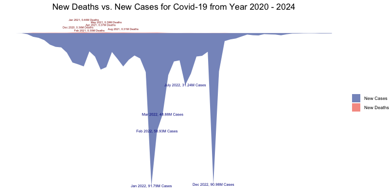

```{r setup, include=FALSE}
knitr::opts_chunk$set(echo = FALSE)
```

# Introduction

We use data visualizations to dive into some significant pandemics from human history, including Cholera, Dengue, and COVID-19, exploring the similarities and differences among these pandemics that happened in large scale in different time periods.

### Objectives

1.  Visualize total cases and deaths over time.
2.  Display geographical spread of pandemics.
3.  Detect changes in disease growth rate with numbers of news reports.
4.  Display the differences in incubation period, mortality rate, and illness duration.

# Background

-   Cholera is an infectious disease that is spread by eating or drinking food or water contaminated by already infected people. This disease typically has outbreaks in regions with poor sanitation.
-   Dengue is a disease transmitted by Aedes mosquitoes that bite people infected with dengue virus. This disease is particularly rampant in tropical and subtropical regions.
-   COVID-19 is a highly contagious respiratory illness caused by the SARS-CoV-2 virus. The pandemics started in late 2019 and declared over in May 2023.

# Exploration

### Total cases and deaths over time

{width="32%"} {width="32%"} {width="32%"}

-   The stream graphs display the local peak values for cases of infected and deaths for three pandemics.
-   For Cholera, there were huge outbreaks in years 2011, 2017, 2019 and 2023, each exceeding 0.5 million total cases yearly. The years with highest numbers of deaths are 2006, 2008, 2010, 2011 and 2017, each exceeding 5000 deaths yearly.
-   For Dengue, there were huge outbreaks in periods of March 2016, May 2019, March 2023 to May 2023 and January 2024 to June 2024, each exceeding 0.60 million total cases monthly. The periods with highest numbers of deaths are months February 2024 to May 2024, each exceeding 1000 deaths monthly.
-   For COVID-19, there were huge outbreaks in periods of January 2022 to March 2022, July 2022 and December 2022, each exceeding 30 million total cases monthly. The periods with highest numbers of deaths are months December 2020 to February 2021, April 2021 to May 2021 and August 2021, each exceeding 0.30 million deaths monthly.

### Geographical spread of pandemics over time

<center>{width="24cm" height="8cm"}</center>

-   The heat maps created in Shiny app reveal the geographical spread of three pandemics. Above is an example of COVID-19 for all years.
-   COVID-19 (2020–2024) shows the highest case counts in regions like the United States, China, and India, with moderate to high cases across Europe, South America, and parts of Africa, while lower case counts are visible in less populated regions.
-   Cholera (2000–2024) cases are most prominent in sub-Saharan Africa and parts of South Asia, with no significant spread in regions like North America and Europe.
-   Dengue (2010–2024) shows the highest concentration in Brazil and South America, with moderate cases in tropical regions like Southeast Asia, Central America, and parts of Africa, while colder regions like Europe and Canada show minimal cases.

### News reports impact on pandemics spread

<center>{width="24cm" height="8cm"}</center>

-   The gray bars and gray line display the number of monthly news articles about COVID-19; the red line represents the monthly new cases of the infected. When the number of news releases rises significantly, the growth in the total number of cases is slowing down, most notably from April to May 2020.
-   The growth rate of the number of news releases in April 2020 is 123.81%, while the growth rate of the total number of cases is only 26.34%. Meanwhile, the number of cases increased extremely rapidly from June to July 2020, with a growth rate of 89.01%, and the growth rate of news releases from June to July was only 8.55%.
-   This interesting phenomenon may also suggest that the number of news releases in the early stages of the pandfemic was able to affect the number of new cases of infection to some extent.

### Differences in disease parameters

{width="48%"} {width="48%"} {width="48%"} {width="48%"}

-   COVID-19 exhibits the longest illness duration of 14 days and an intermediate incubation period of 5 days. Its mortality rate is 2.5%, which is relatively low compared to Cholera. Relatively lower values for mortality and incubation suggests prolonged disease management compared to the others.
-   Cholera has the shortest incubation period of 2 days and the highest mortality rate of 5%, but its illness duration is 7 days, which is moderate. There is a spike in mortality rate compared to COVID-19. While this has a short incubation period, the mortality rate reflects how quickly it can impact populations, necessitating immediate intervention. Its high mortality demands urgent responses in outbreaks.
-   Dengue features the longest incubation period of 7 days. Its mortality rate of 0.1% is the lowest among these three pandemics. Low mortality and moderate illness duration make it appear less severe when compared with Cholera and COVID-19. However, the longer incubation period suggests delayed symptom onset, which can complicate diagnosis.


# Conclusions

-   Different epidemics have different types of outbreaks. Dengue pandemics occurred seasonally, mostly late spring to early summer. This is likely due to the propogation of Aedes mosquitoes during these periods, which are responsible for the spread of the dengue pandemics. Cholera epidemics outbreaks are closely related to contamination of water sources, which is associated with years with heavy rainfall and flooding. COVID-19 had higher mortality rate at the early stage of pandemics than at the late stage, likely due to the vaccine access at the late stage; the total infected cases had spiked at the late stage, likely due to the end of quarantine measure.

-   The monthly number of news articles related to COVID-19 and the month total cases of infected COVID-19 are inversely correlated. It can be reasonably inferred that the news of COVID-19 helped raise people's awareness of the pandemics, reminding people to sanitize frequently and reducing social contacts, which then indirectly reduced the number of total cases.

# Future Directions

-   Emphasize on the time stamps of each pandemics where there were huge outbreaks, and research on the reasons behind them.

-   Research on pandemics other than Cholera, Dengue and COVID-19, and compare the results to find the differences and similarities. Summarize the methods to efficiently contain the spread of pandemics.

# References

-   Cholera: <https://worldhealthorg.shinyapps.io/page10cholera_data/>
-   Dengue: <https://worldhealthorg.shinyapps.io/dengue_global/>
-   COVID-19: <https://data.who.int/dashboards/covid19/data>
