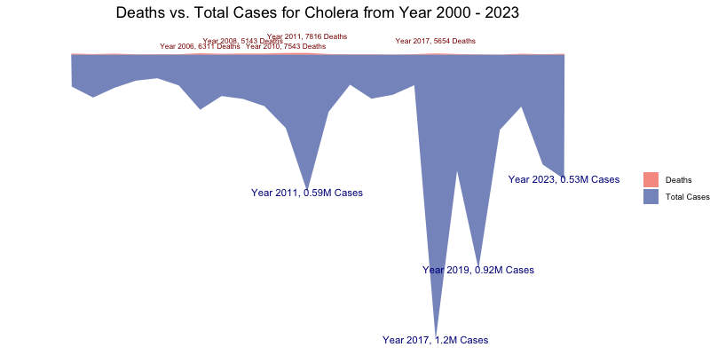
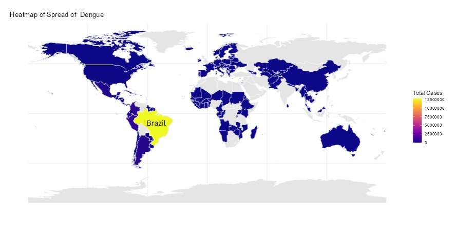
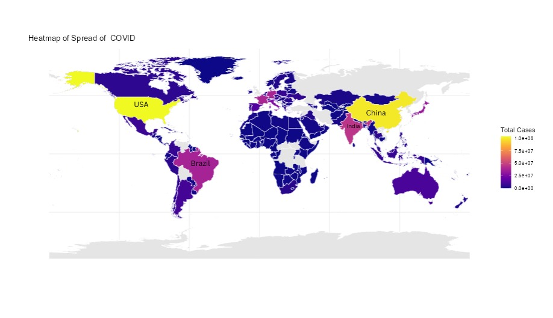

```{r setup, include=FALSE}
knitr::opts_chunk$set(echo = FALSE)
```

# Introduction

We use data visualizations to explore the similarities and differences among some significant pandemics from human history, including Cholera, Dengue, and COVID-19.

# Exploration

### Total cases and deaths over time

<center>{width="98%"}</center>

<center>{width="98%"}</center>

<center>{width="98%"}</center>

### Geographical spread of pandemics over time

<center>{width="80%"}</center>

<center>{width="80%"}</center>

<center>{width="80%"}</center>

### News reports impact on pandemics spread

<center>{width="80%"}</center>

<br>

### Differences in disease parameters

<center>{width="100%"}</center>

# Conclusions

-   Dengue occurred seasonally, mostly late spring to early summer. Cholera outbreaks are closely related to contamination of water sources. COVID-19 had higher mortality rate at the early stage and the total infected cases had spiked at the late stage.
-   The monthly number of news articles related to COVID-19 and the month total cases of infected COVID-19 are inversely correlated.
-   Among the three pandemics, COVID-19 has the longest illness duration; Cholera has the highest mortality rate; Dengue has the longeset incubation period.

# Future Directions

-   Emphasize on the time stamps of each huge outbreaks and research on the reasons behind them.
-   Research on other pandemics and compare the results.

# References

-   Cholera: <https://worldhealthorg.shinyapps.io/page10cholera_data/>
-   Dengue: <https://worldhealthorg.shinyapps.io/dengue_global/>
-   COVID-19: <https://data.who.int/dashboards/covid19/data>
