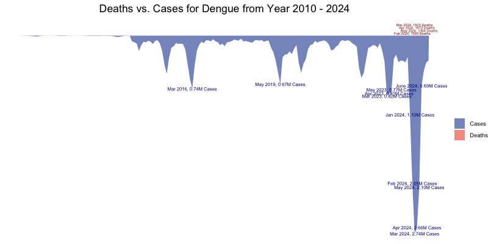

```{r setup, include=FALSE}
knitr::opts_chunk$set(echo = FALSE)
```

# Introduction

We use data visualizations to dive into the statistics of some significant pandemics from human history, including Cholera, Dengue, and COVID-19. We visually present and explore the similarities and differences among these pandemics or diseases that happened in large scale in different time periods.

## Objectives

1.  Use stream graphs to visualize total cases and deaths over time.
2.  Use Shiny app to display geographical spread of pandemics over time.
3.  Use time series and scatter plot to detect changes in disease growth rate before and after news reports.
4.  Use radar charts to display the differences in incubation period, mortality rate, and illness duration across pandemics.

# Background

-   Cholera is an infectious disease that is spread by eating or drinking food or water contaminated by already infected people. This disease typically has outbreaks in regions with poor sanitation.
-   Dengue is a disease transmitted by Aedes mosquitoes that bite people infected with dengue virus. This disease is particularly rampant in tropical and subtropical regions.
-   COVID-19 is a highly contagious respiratory illness caused by the SARS-CoV-2 virus. The pandemics started in late 2019 and declared over in May 2023.

# Exploration

## Total cases and deaths over time

{width="32%"} {width="32%"} {width="32%"}

The stream graphs display the local peak values for cases of infected and deaths over time for three pandemics. Cholera dataset includes global cases officially reported to WHO from 2000 to 2023. Dengue dataset includes global cases from WHO Global dengue surveillance from 2010 to 2024. COVID-19 dataset includes global cases from WHO COVID-19 dashboard data from 2020 to 2024.

-   For Cholera, there were huge outbreaks in years 2011, 2017, 2019 and 2023, all of which had total cases over 0.5 million. The years with highest numbers of deaths are 2006, 2008, 2010, 2011 and 2017, all of which exceeded 5000 deaths.

-   For Dengue, there were huge outbreaks in periods of March 2016, May 2019, March 2023 to May 2023 and January 2024 to June 2024, all of which had monthly total cases over 0.60 million. The periods with highest numbers of deaths are months February 2024 to May 2024, all of which exceeded monthly 1000 deaths.

-   For COVID-19, there were huge outbreaks in periods of January 2022 to March 2022, July 2022 and December 2022, all of which had monthly total cases over 30 million. The periods with highest numbers of deaths are months December 2020 to February 2021, April 2021 to May 2021 and August 2021, all of which exceeded monthly 0.30 million deaths. Some of these numbers of deaths even exceeded the number of monthly new cases since February 2024.

## Geographical spread of pandemics over time

(insert plots from Meghana)

(space)

(space)

(space)

(space)

(space)

(space)

## News reports impact on pandemics spread

(insert plots from Li)

(space)

(space)

(space)

(space)

(space)

(space)

## Differences in disease parameters

(insert plots from Surya)

(space)

(space)

(space)

(space)

(space)

(space)

# Conclusions

(Write down our observations from the plots here.) (For example, summarize the similarities and differences among these epidemics) (State the meaning of our project, such as handling future epidemics)

(space)

(space)

(space)

(space)

(space)

(space)

(space)

(space)

# Future Directions

(Discuss how we can improve on the visualizations or approaches, such as possible additions) (Discuss what other epidemics that we did not explore in this project but are interested in exploring them in future opportunities)

(space)

(space)

(space)

(space)

(space)

(space)

(space)

# References

-   Cholera: <https://worldhealthorg.shinyapps.io/page10cholera_data/>

-   Dengue: <https://worldhealthorg.shinyapps.io/dengue_global/>

-   COVID-19: <https://data.who.int/dashboards/covid19/data>
